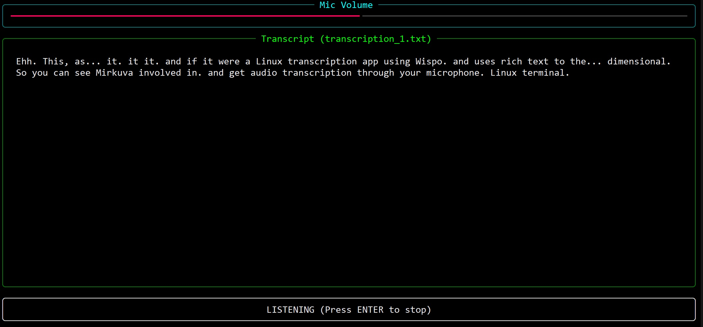

# Real-Time Whisper Transcription (WSL2 & Native Linux)

A high-performance Python tool that provides a live-updating terminal dashboard for transcribing microphone audio in real-time.




## ✨ Features

- 🖥️ **Rich Terminal UI**: Live VU meter, status updates, and word-wrapped transcription area.
- 🔄 **Smart Backend Switching**: 
  - **WSL2**: Uses `PulseAudio (parec)` to capture Windows audio without special drivers.
  - **Native Linux**: Uses `sounddevice` for low-latency native recording.
- ⚡ **Streaming Transcription**: Displays text as you speak using OpenAI's Whisper models.
- 📁 **Smart File Management**: Automatically saves to the `transcripts/` folder. It never overwrites; it increments filenames (e.g., `transcription_1.txt`).
- ⌨️ **Clean Exit**: Simply press **ENTER** to stop. No more hanging processes or core dumps.

## 🛠️ Quick Start

### 1. Install System Dependencies
```bash
# Ubuntu / Debian / WSL2
sudo apt update && sudo apt install -y ffmpeg pulseaudio-utils libportaudio2 python3-venv
```
### 2. Run Setup
```Bash

chmod +x setup.sh
./setup.sh
```

### 3. Start Transcribing
```Bash

./run.sh

```

⚙️ Configuration (CLI Options)

You can pass arguments to ./run.sh just like a normal python script:


|Option	| Description |
|-----|-----------------------------------------------------|
|-m	| Model: tiny, base, small, medium. (Default: tiny) |
|-o	| Output: Filename (saved in transcripts/). |
|-c	| Chunk Size: Seconds of audio to process at once. (Default: 4) |

Examples:
```Bash

# High accuracy mode (slower)
./run.sh -m small -c 10

# Custom output file
./run.sh -o my_interview.txt
```

💡 WSL2 & Audio

This script is specifically optimized for WSL2 users on Windows 11 (WSLg).

- If your Windows microphone is set as the "Default" device, WSL2 picks it up automatically.

- The script detects the microsoft kernel and switches to the parec (PulseAudio) backend for a reliable stream.

Note: If the VU meter isn't moving, ensure your microphone isn't muted in Windows "Sound Settings."

🗂️ Directory Structure

    whisper_transcribe.py: The main logic.

    transcripts/: Where your finished text files are stored.

    whisper_models/: Where the AI models are cached (downloaded once).

⚠️ Troubleshooting

- No text appearing? Watch the "Mic Volume" bar. If it's not moving while you talk, the script isn't getting audio.

- Slow updates? If "Transcribing..." stays on screen for too long, your CPU is struggling. Use -m tiny.

- Keyboard issues? Ensure the terminal window has focus when you press ENTER.
